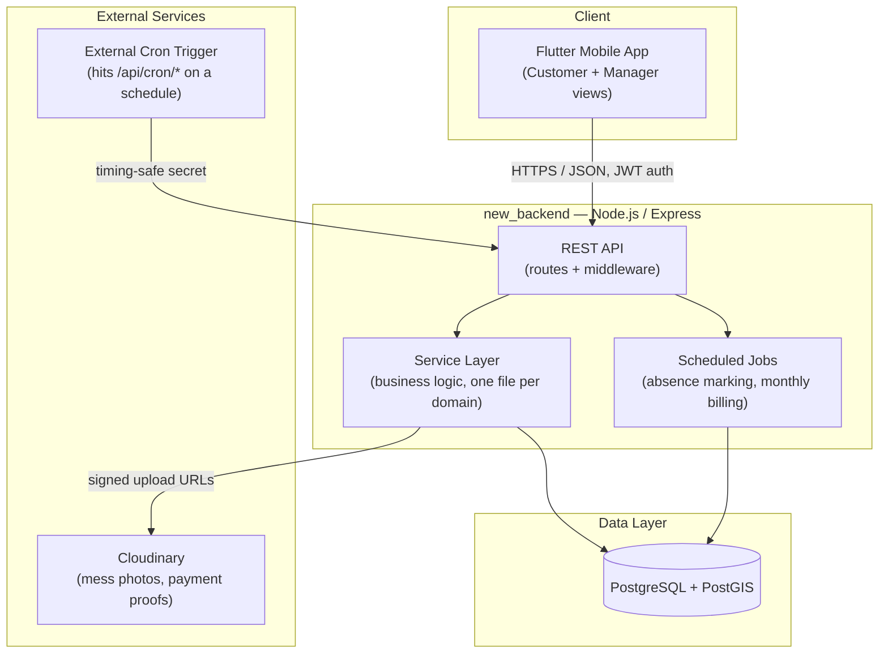
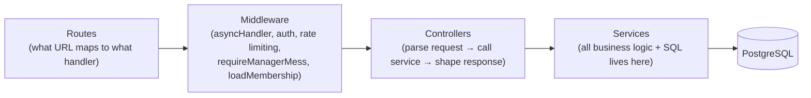
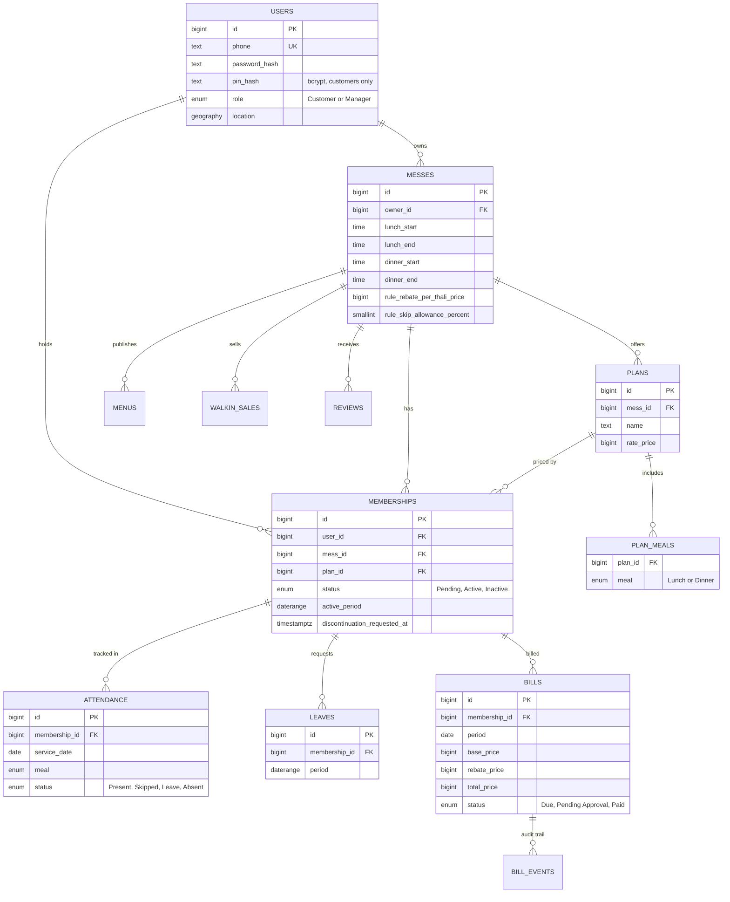
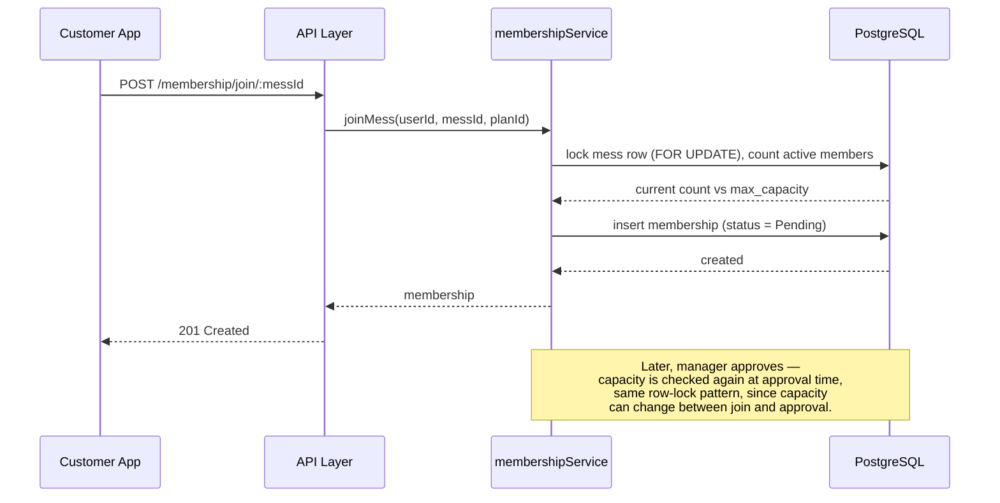
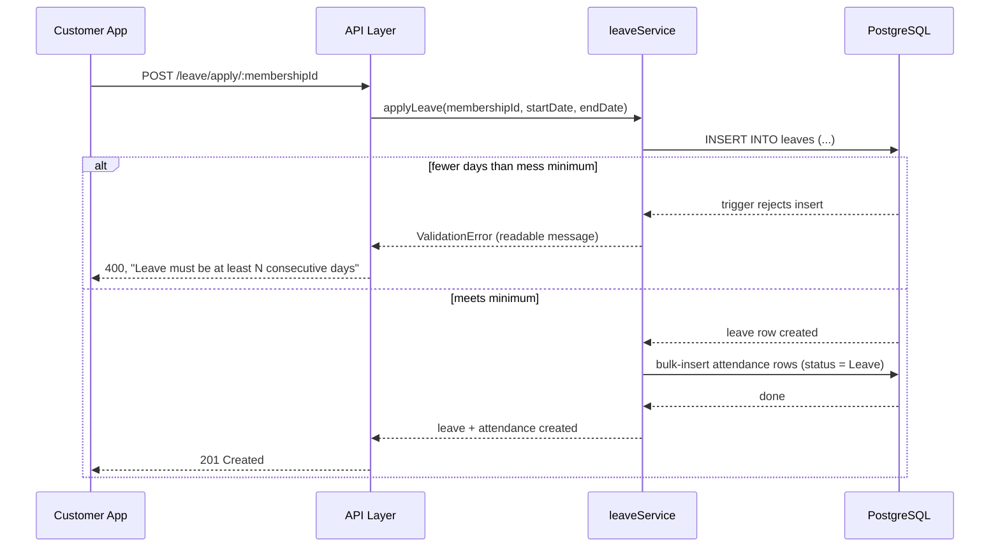
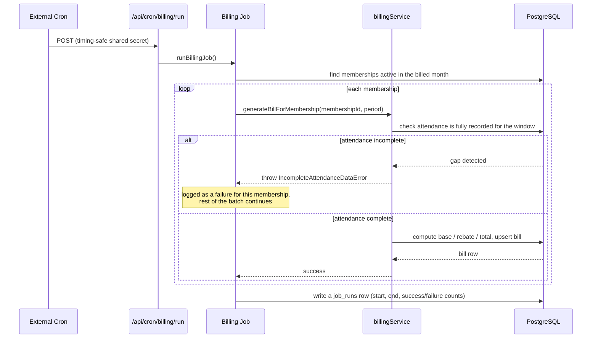
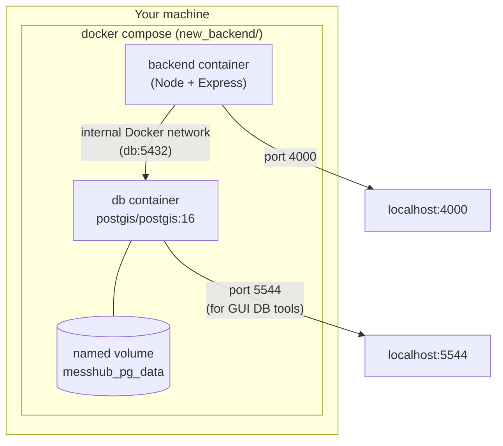

# Mess Hub Backend — High-Level Design (HLD)

**Scope of this document:** the backend rewrite living in `new_backend/`. The
Flutter mobile app and the original MongoDB backend (`backend/`) are described
here only as far as needed for context — they are not being changed by this
document.

**What this document is NOT:** a Low-Level Design. You won't find exact
function signatures, full route tables, or per-field API contracts here — those
live in the companion **[LLD](LLD.md)**, written against the finished code. This
document is the stable part: what the system is, how its pieces fit together,
and _why_ it's built this way.

---

## Table of Contents

1. [System Overview](#1-system-overview)
2. [High-Level Architecture](#2-high-level-architecture)
3. [Tech Stack & Why](#3-tech-stack--why)
4. [Layered Architecture Inside the Backend](#4-layered-architecture-inside-the-backend)
5. [Data Model Overview](#5-data-model-overview)
6. [Key Flows](#6-key-flows)
7. [Deployment Architecture](#7-deployment-architecture)
8. [Cross-Cutting Concerns](#8-cross-cutting-concerns)
9. [Why a Rewrite — Old System vs New System](#9-why-a-rewrite--old-system-vs-new-system)
10. [Project Status](#10-project-status)

---

## 1. System Overview

Mess Hub is a two-sided marketplace connecting **mess owners** (small
meal-subscription food businesses, common in Indian cities) with
**customers** who subscribe to daily lunch/dinner plans.

Two actors, two very different jobs to do:

- **Customer** — discovers nearby messes on a map, joins one with a monthly
  or daily plan, marks their own attendance (present / skip / leave), views
  bills, pays, and reviews the mess.
- **Manager** — runs the mess: sets up plans and pricing rules, marks
  attendance via a shared kiosk device, watches a live "who's eating right
  now" dashboard, approves join requests and payments.

The backend's job is to be the single source of truth for all of this:
membership state, attendance history, and — the part that actually has to be
_correct_, not just functional — monthly billing math (base plan charge,
minus rebates for approved leave/skips, floored at a minimum charge).

---

## 2. High-Level Architecture

**Why this shape:**

- **A single REST API**, not microservices. The whole domain (membership,
  attendance, billing) is one tightly related transactional unit — splitting
  it into services would just mean re-implementing transactions across
  network calls for no benefit at this scale.
- **PostgreSQL, not the old system's MongoDB.** This is the single biggest
  architectural decision in the rewrite, covered in depth in
  [§9](#9-why-a-rewrite--old-system-vs-new-system) — the short version is
  that Mess Hub's data is fundamentally relational (four-level foreign-key
  chains, date-range overlap rules, money that needs real constraints), and
  the old codebase was hand-rolling relational guarantees in JavaScript that
  Postgres just... has built in.
- **Jobs run inside the same backend**, triggered by an external cron ping
  rather than a separate worker process — this app's background work
  (marking absences, generating monthly bills) is not heavy enough to justify
  a separate job runner/queue infrastructure.

---

## 3. Tech Stack & Why

| Layer            | Choice                            | Why                                                                                                                                                                                                                    |
| ---------------- | --------------------------------- | ---------------------------------------------------------------------------------------------------------------------------------------------------------------------------------------------------------------------- |
| Mobile client    | Flutter                           | Existing app, unchanged by this rewrite                                                                                                                                                                                |
| API server       | Node.js + Express                 | Matches the team's existing skill set; Express is simple enough not to fight a beginner-readable codebase                                                                                                              |
| Database         | PostgreSQL 16 + PostGIS           | Relational integrity (foreign keys, `CHECK` constraints, exclusion constraints) is exactly what this domain needs — see §9. PostGIS adds proper geospatial queries for "messes near me"                                |
| Query layer      | Knex.js (not an ORM)              | Gives connection pooling + a real migration system, but billing/attendance queries are hand-written SQL — an ORM's query builder actively gets in the way of the window functions and set-based upserts this app needs |
| Auth             | JWT (`jsonwebtoken`) + `bcryptjs` | Stateless auth suits a mobile client; passwords **and** kiosk PINs are hashed (the old app hashed passwords but stored PINs in plain text — fixed here)                                                                |
| Image storage    | Cloudinary                        | Mess photos and payment-proof uploads; kept from the old system, works fine as-is                                                                                                                                      |
| Containerization | Docker + Docker Compose           | Reproducible local dev environment, and the same image is what would ship to production                                                                                                                                |
| Validation       | Joi                               | Request-shape validation at the API boundary, before anything reaches a service                                                                                                                                        |

---

## 4. Layered Architecture Inside the Backend

**The rule that keeps this simple:** controllers never contain business logic
or raw SQL, and services never touch `req`/`res`. If you're ever unsure where
a piece of code belongs, ask "does this need to know about HTTP?" — if no, it
goes in a service, and services are plain functions you can unit-test without
spinning up a server at all.

This is a direct fix for a real problem in the old codebase: the same "does
this manager own this mess?" check was copy-pasted by hand into **17
different controller functions**. Here, it's one middleware
(`requireManagerMess`) used everywhere.

---

## 5. Data Model Overview

The full schema with every column, constraint, and the reasoning behind each
one lives in [`db/schema.sql`](../db/schema.sql) — that file is the actual
source of truth. This is the simplified picture:

### Design decisions worth being able to explain

- **Money is `BIGINT` paise, never a float.** ₹50.00 is stored as `5000`.
  Floating point money is a classic interview red flag to catch in someone
  else's code — here it's simply not possible to make that mistake, since
  there's no decimal type involved anywhere in the money columns.
- **Calendar-day concepts are `DATE` columns, not timestamps.** Attendance,
  leave, and menu dates are `DATE`, not `TIMESTAMPTZ`. This eliminates an
  entire bug class from the old system, where "today" was computed by taking
  a UTC timestamp and manually shifting it by 5.5 hours in JavaScript — done
  correctly in some places and incorrectly in others, causing meals to be
  attributed to the wrong calendar day.
- **`EXCLUDE USING gist` constraints instead of application-level overlap
  checks.** Two things must never overlap: a leave period for the same
  membership, and two _Active_ memberships for the same user at the same
  mess. Both are enforced as real database constraints (`leaves`,
  `memberships`), not a hand-written "check nothing else overlaps" query
  that runs before an insert and can lose a race condition. This is a
  genuinely good thing to be able to explain in an interview — it's a step
  up from typical bootcamp-level "we validated it in the backend."
- **A database trigger enforces the minimum-leave-days business rule**
  (`trg_leaves_min_days` in `schema.sql`). A leave request under the mess's
  configured minimum is rejected _by Postgres itself_, not by application
  code that could be bypassed by a bug elsewhere or a second code path. One
  rule, one place it's enforced, impossible to duplicate incorrectly.
- **`plan_meals` is a real join table**, not a string. The old system
  decided whether a plan included lunch by checking if the plan's _display
  name_ contained the word "lunch" — done with `.includes('lunch')`,
  independently, in **nine different places** in the old codebase. A plan
  named "Deluxe" would silently break attendance and billing for anyone on
  it. Here it's one row per plan per meal, queried with a `JOIN`.

---

## 6. Key Flows

These are intentionally kept at HLD granularity — actors and layers, not
function names. The detailed step-by-step will live in the LLD once the
services are built.

### 6.1 Customer joins a mess, manager approves

The row lock (`SELECT ... FOR UPDATE`) matters here: without it, two
customers joining at the exact same moment when the mess has exactly one
spot left could both read "capacity available" before either insert commits,
and both get in. This is a classic **race condition**, and it's exactly the
kind of bug that's easy to miss in testing (works fine with one user) and
painful in production (works fine until it doesn't).

### 6.2 Customer applies for leave

Notice there's no manager-approval step here — the spec calls for leave
requests to auto-approve once the day-count rule is met, and the trigger
_is_ that eligibility check. (This is a different feature from "leave the
mess" / discontinuing a membership, which _does_ need manager approval —
the two are deliberately named and modeled differently in the schema so
they can't get confused with each other.)

### 6.3 Monthly billing job

The important design choice here: billing **refuses to guess**. If the
absence-marking job hasn't finished writing records for part of the month
(for whatever reason — a crash, a missed run), billing for that membership
fails loudly instead of silently treating the gap as "nothing happened" —
which in the old system meant a free rebate for missing data. One
membership's failure doesn't roll back the whole batch, and every run is
logged to `job_runs`, so a partial failure is something you can actually see
happened, not something that just quietly loses money.

---

## 7. Deployment Architecture

### Local development (built and working today)

The `db` container's healthcheck gates the `backend` container's startup —
Compose won't start the backend until Postgres is actually accepting
connections, not just "the container process started." See `DOCKER.md` for
the exact commands.

### Production (planned, not yet decided)

The old backend deploys to Render (see the repo's `render.yaml`). The new
backend is expected to follow a similar path — a Node web service plus a
managed Postgres instance with the PostGIS extension enabled — but the
specific provider/config for `new_backend` hasn't been finalized yet. This
section gets filled in once that decision is made.

---

## 8. Cross-Cutting Concerns

These apply across every feature, not to any one flow:

- **Authentication:** JWT, checked once in middleware, attaches the
  authenticated user to the request. Route-level middleware
  (`authorize('Manager')`, etc.) gates who can call what.
- **Timezone correctness:** every database connection is set to `Asia/Kolkata`
  the moment it's created (see `db/knexfile.js`), and calendar-day data uses
  `DATE`/`TIME` columns instead of timestamps wherever only the day/time-of-day
  matters. This is a deliberate, systemic fix — see §5 and §9.
- **Rate limiting:** login and kiosk PIN-entry endpoints are rate-limited.
  A 4-digit kiosk PIN is only ~10,000 possibilities — without a limiter,
  it's brute-forceable.
- **Consistent error shape:** every error response follows
  `{ success: false, code, message }`, generated by one global error handler
  from typed errors (`ValidationError`, `NotFoundError`, etc.) that services
  throw — never `res.status(...)` calls scattered through business logic.
- **No unhandled crashes:** every async controller is wrapped so a rejected
  promise can't crash the process or hang a request silently; the server
  also listens for `unhandledRejection`/`uncaughtException` at the process
  level as a last-resort safety net.

---

## 9. Why a Rewrite — Old System vs New System

This is worth being able to talk through fluently — it's the strongest
"before vs after" story in the whole project.

| Problem in the old (MongoDB) backend                                                                                                                | How the new schema/design fixes it                                                                                                |
| --------------------------------------------------------------------------------------------------------------------------------------------------- | --------------------------------------------------------------------------------------------------------------------------------- |
| Plan meal-eligibility decided by `.includes('lunch')` on a display name, duplicated in 9 places                                                     | `plan_meals` join table, queried once                                                                                             |
| Same "does this manager own this mess?" check copy-pasted in 17 controller functions                                                                | One `requireManagerMess` middleware                                                                                               |
| Leave overlap checked with a hand-rolled `$or` query — a race condition waiting to happen                                                           | `EXCLUDE USING gist` constraint — the database itself refuses an overlapping row                                                  |
| Membership capacity checked with a separate read-then-write (classic TOCTOU race)                                                                   | `SELECT ... FOR UPDATE` inside one transaction                                                                                    |
| Money stored as JavaScript floating-point numbers, rounded with `Math.round(x*100)/100` scattered through controllers                               | `BIGINT` paise everywhere; no float ever touches a money value                                                                    |
| "Today" computed by manually shifting UTC timestamps by 5.5 hours — done inconsistently across files                                                | `DATE` columns + one enforced session timezone; the ambiguity doesn't exist                                                       |
| Missing attendance record silently treated as a rebate (free money)                                                                                 | Billing has a completeness gate — refuses to run rather than guess                                                                |
| Bills keyed by `(user, mess, month)` — a user who left and rejoined the same mess could have their second month's bill silently overwrite the first | Bills keyed by `(membership_id, period)` — each membership stint is its own row                                                   |
| No tests anywhere in the codebase, especially not on the billing math                                                                               | `billingService` is built test-first, with a 14-case test matrix covering proration, rebates, edge cases, and safety-net behavior |

The full line-by-line audit this table is summarized from was done against
the live `backend/` codebase and is preserved in this project's history —
every row above corresponds to an actual bug found in real code, not a
hypothetical.

---

## 10. Project Status

| Phase | Contents                                                               | Status  |
| ----- | ---------------------------------------------------------------------- | ------- |
| 0     | Schema design (`db/schema.sql`)                                        | ✅ Done |
| 1     | Docker + Postgres + Knex migrations                                    | ✅ Done |
| 2     | Service layer (`billingService` first, test-first)                     | ✅ Done |
| 3     | Middleware (`asyncHandler`, auth guards, rate limiting, error handler) | ✅ Done |
| 4     | Controllers and routes, one domain at a time                           | ✅ Done |
| 5     | Jobs (absence marking, monthly billing) as set-based SQL               | ✅ Done |
| 6     | Cleanup, dependency updates, LLD                                       | ✅ Done |

The backend is functionally complete: 35 unit tests and 155 end-to-end API
checks pass against the real Dockerized Postgres, with no lint problems and no
dependency vulnerabilities. The architecture described above held throughout,
and the companion **[LLD](LLD.md)** documents the finished code.
