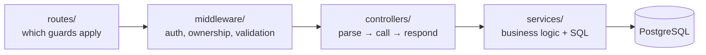
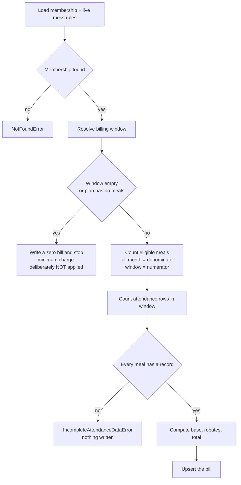
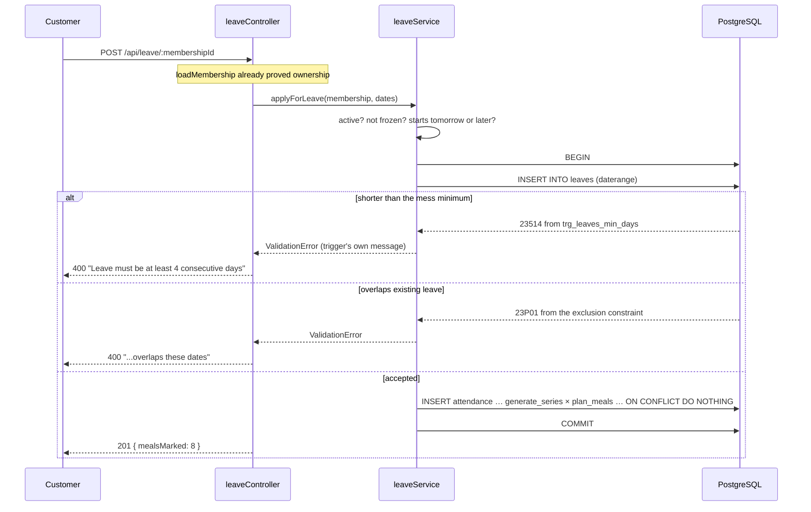
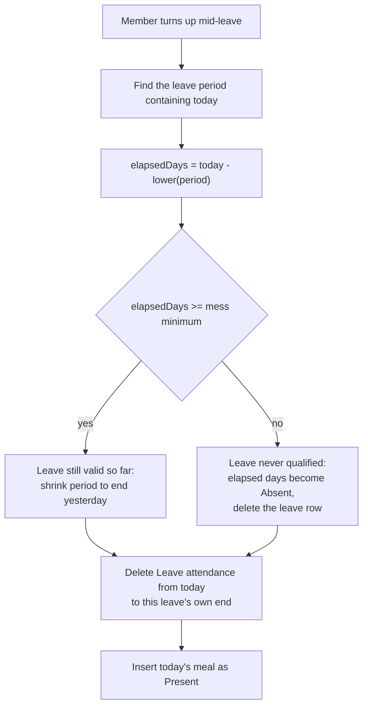
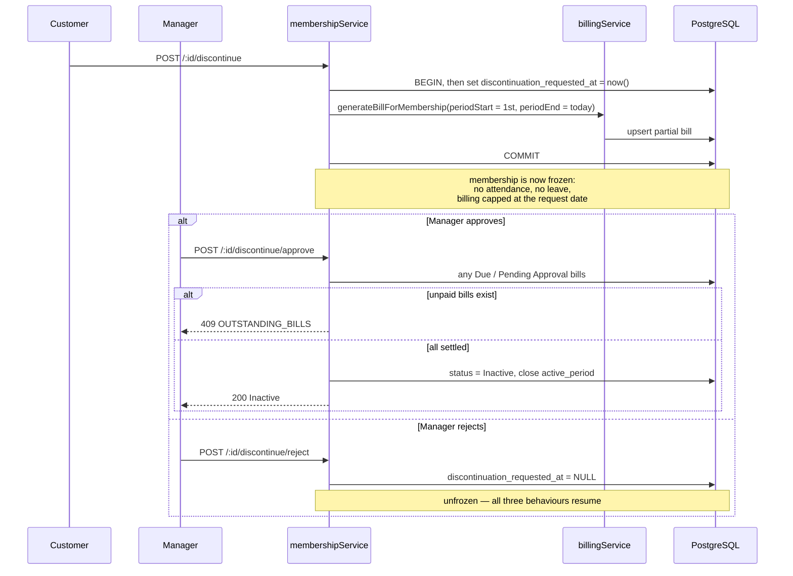

# Mess Hub Backend — Low-Level Design (LLD)

**Companion to [HLD.md](HLD.md).** The HLD says what the system is and why it
is shaped that way. This document is the level below: the actual tables,
constraints, function signatures, algorithms and error paths, written against
the finished code rather than a plan.

Everything here is verifiable — the file and function names are real, and the
behaviour described is covered by 35 unit tests and 155 API checks.

---

## Contents

1. [Layers and the rules between them](#1-layers-and-the-rules-between-them)
2. [Database schema in detail](#2-database-schema-in-detail)
3. [Constraint catalogue](#3-constraint-catalogue)
4. [Money and time](#4-money-and-time)
5. [Service contracts](#5-service-contracts)
6. [The billing algorithm](#6-the-billing-algorithm)
7. [Concurrency](#7-concurrency)
8. [Middleware pipeline](#8-middleware-pipeline)
9. [Error model](#9-error-model)
10. [Background jobs](#10-background-jobs)
11. [Key sequences](#11-key-sequences)
12. [Test strategy](#12-test-strategy)

---

## 1. Layers and the rules between them



Two rules hold everywhere, and they are what keep the codebase navigable:

| Rule                                             | Consequence                                                     |
| ------------------------------------------------ | --------------------------------------------------------------- |
| Controllers contain no business logic and no SQL | Every controller is 3–8 lines; logic has exactly one home       |
| Services never touch `req` / `res`               | Services are plain functions, unit-testable with no HTTP server |

A third, less obvious rule: **a route's guards are visible in the route file.**
Nothing is enforced invisibly inside a controller. Reading
`routes/billingRoutes.js` tells you exactly who can call each billing endpoint.

### Directory responsibilities

| Directory      | Holds                                           | Never holds                |
| -------------- | ----------------------------------------------- | -------------------------- |
| `routes/`      | Path → guards → controller wiring               | Logic                      |
| `controllers/` | Request parsing, response shaping               | SQL, rules                 |
| `services/`    | Business rules, SQL, transactions               | `req`, `res`, status codes |
| `middleware/`  | Cross-cutting concerns                          | Domain rules               |
| `jobs/`        | Scheduled work                                  | HTTP concerns              |
| `errors/`      | Typed error classes                             | —                          |
| `utils/`       | Pure helpers (dates, money, pagination, config) | Database access            |

---

## 2. Database schema in detail

Source of truth: [`db/schema.sql`](../db/schema.sql). Applied by
`db/migrations/20260101000000_init.js`.

### Enumerated types

| Type                | Values                                   |
| ------------------- | ---------------------------------------- |
| `user_role`         | `Customer`, `Manager`                    |
| `mess_service_type` | `Monthly Only`, `Both Daily & Monthly`   |
| `mess_cuisine`      | `Veg`, `Non-Veg`, `Both`                 |
| `meal_type`         | `Lunch`, `Dinner`                        |
| `membership_status` | `Pending`, `Active`, `Inactive`          |
| `attendance_status` | `Present`, `Skipped`, `Leave`, `Absent`  |
| `bill_status`       | `Due`, `Pending Approval`, `Paid`        |
| `bill_event_type`   | `ProofSubmitted`, `Approved`, `Rejected` |

Using real enum types rather than free-text columns means an invalid status
cannot be stored at all, and the four attendance states are a closed set.

### Tables

**`users`** — one row per person, both roles.

| Column          | Type                    | Notes                                                |
| --------------- | ----------------------- | ---------------------------------------------------- |
| `id`            | `BIGINT` identity       |                                                      |
| `phone`         | `VARCHAR(10)` UNIQUE    | `CHECK` enforces 10 digits; this is the login handle |
| `password_hash` | `TEXT`                  | bcrypt, cost 10                                      |
| `pin_hash`      | `TEXT`                  | bcrypt. Customers only — the 4-digit kiosk PIN       |
| `role`          | `user_role`             |                                                      |
| `location`      | `GEOGRAPHY(POINT,4326)` | Customers only; drives "messes near me"              |

A single table-level `CHECK` captures the role rule:
`role <> 'Customer' OR (pin_hash IS NOT NULL AND location IS NOT NULL)`.

**`messes`** — one row per business, owned by a manager.

Timings are four real `TIME` columns (`lunch_start`, `lunch_end`,
`dinner_start`, `dinner_end`), not JSON, so "is a meal being served right now"
is a `WHERE` clause rather than application parsing. Billing rules are likewise
flattened into typed columns (`rule_rebate_per_thali_price`,
`rule_skip_allowance_percent`, `rule_allow_absent_rebate`,
`rule_min_monthly_charge_price`, `rule_min_leave_days_for_rebate`) because
billing reads every one of them on every run and each needs its own `CHECK`.

`rule_security_deposit_price` is **display-only** — the advertised caution money
a customer sees before joining. The system never collects, tracks or bills it;
that stays an offline arrangement.

`rating_avg` and `rating_count` are denormalised and maintained by a trigger,
so listing messes never recomputes review averages.

**`plans`** and **`plan_meals`** — a plan is "Lunch Only, ₹3500/month".
`plan_meals(plan_id, meal)` is the relational fact of which meals it covers.
Plans are retired via `is_active = false`, never deleted, because memberships
hold a foreign key to them.

**`memberships`** — one row per stint at a mess. Note there is deliberately **no
rate column**: pricing is live, so the rate always comes from a `JOIN` to
`plans.rate_price` as it stands right now. If a manager changes a plan's rate,
every member on that plan is billed the new rate from their next bill onwards.
Nothing is snapshotted, so the membership and the plan can never disagree.
`active_period` is a `DATERANGE`; the upper bound is open while the membership is
running and closed when it ends. `discontinuation_requested_at` is the single
freeze flag (see §5).

**`attendance`** — one row per membership, per day, per meal, holding one of the
four states. `mess_id` is denormalised onto it purely for the dashboard's hot
path.

**`walkin_sales`** — non-member thali sales. A separate table because a walk-in
is a sale, not a subscription meal state; the old backend forced these into
`attendance` with null user and membership columns, so every attendance query
had to remember to exclude them.

**`leaves`** — holiday leave as a `DATERANGE`, scoped to `membership_id`.

**`bills`** and **`bill_events`** — a bill per membership per month, plus an
append-only event log of who submitted, approved or rejected a payment and what
proof was attached at the time.

**`menus`**, **`reviews`**, **`job_runs`** — day's menu per mess, one review per
customer per mess, and a record of every background job run.

---

## 3. Constraint catalogue

The constraints are the part of this design most worth understanding: each one
replaces application code that could be bypassed or lose a race.

| Constraint                                                                          | Table         | What it guarantees                                                                                       |
| ----------------------------------------------------------------------------------- | ------------- | -------------------------------------------------------------------------------------------------------- |
| `UNIQUE (membership_id, service_date, meal)`                                        | `attendance`  | One record per meal. Makes the absence job safely re-runnable via `ON CONFLICT DO NOTHING`               |
| `UNIQUE (membership_id, period)`                                                    | `bills`       | One bill per membership per month. Rejoining a mess produces a _separate_ bill instead of overwriting    |
| `CHECK (rebate_price <= base_price)`                                                | `bills`       | A rebate can never exceed the charge                                                                     |
| `CHECK (total_price >= 0)`                                                          | `bills`       | No negative invoice                                                                                      |
| `EXCLUDE USING gist (membership_id =, period &&)`                                   | `leaves`      | No overlapping leave — enforced by the index, not a pre-check                                            |
| `EXCLUDE USING gist (user_id =, mess_id =, active_period &&) WHERE status='Active'` | `memberships` | No two simultaneously-active memberships at one mess; sequential stints are fine                         |
| `trg_leaves_min_days` (trigger)                                                     | `leaves`      | Rejects leave shorter than that mess's minimum, so every stored leave is rebate-eligible by construction |
| `trg_reviews_rating_sync` (trigger)                                                 | `reviews`     | Keeps `messes.rating_avg` / `rating_count` correct however the row was written                           |
| `CHECK (lunch_end <= dinner_start)` etc.                                            | `messes`      | Meal windows are ordered and non-overlapping                                                             |
| `UNIQUE (lower(mess_name), lower(address))`                                         | `messes`      | No duplicate listing differing only by case                                                              |
| `UNIQUE (mess_id, lower(name))`                                                     | `plans`       | No two plans with the same name in one mess                                                              |

### Why exclusion constraints instead of a check-then-insert

The obvious way to prevent overlapping leave is to query for a clash and insert
if none is found. Two requests arriving together both find nothing and both
insert. An `EXCLUDE USING gist` constraint is evaluated by the index at write
time, so the second write fails no matter how close together they arrive. The
`btree_gist` extension is what lets a single constraint mix equality on
`membership_id` with range overlap on `period`.

---

## 4. Money and time

### Money

Every `*_price` column is a `BIGINT` holding rupees × 100 — ₹6000 is `600000`.
No decimal type is used anywhere, so there is no floating-point rounding to get
wrong. The API speaks plain rupees (`rateRupees: 6000`); `utils/money.js`
(`rupeesToPrice`, `priceToRupees`) is the only place the two meet — convert at
the edge, never mid-calculation.

`db/knex.js` also registers a `pg` type parser so `BIGINT` arrives as a JS
number rather than the driver's default string. Safe here: JavaScript is exact
for integers up to ~9 quadrillion, far beyond any id or rupee amount in this
system.

### Time

| Concept                              | Type          | Why                                                                     |
| ------------------------------------ | ------------- | ----------------------------------------------------------------------- |
| Attendance, leave, menu, bill period | `DATE`        | Only the calendar day matters — no instant, so no timezone to get wrong |
| Meal windows                         | `TIME`        | IST wall-clock, compared in SQL                                         |
| Audit timestamps                     | `TIMESTAMPTZ` | These are genuine instants                                              |

Two mechanisms keep IST correct:

1. **Pool level** — `db/knexfile.js` runs `SET TIME ZONE 'Asia/Kolkata'` in
   `pool.afterCreate`, so every connection is in IST from the moment it exists.
2. **Query level** — `services/messClock.js` and `jobs/absenceJob.js`
   additionally write `(now() AT TIME ZONE 'Asia/Kolkata')` explicitly, so their
   correctness does not silently depend on the hook having run.

In application code, dates are plain `'YYYY-MM-DD'` strings (`utils/dates.js`),
never `Date` objects. A useful side effect: ISO date strings compare correctly
as text, so `earlier`/`later` are just `<` and `>`.

> **Gotcha worth remembering:** never write a `?` inside a Knex raw query —
> _even in a SQL comment_. Knex scans the whole string for placeholders and will
> count it, then fail with a bindings mismatch. This cost real debugging time
> and is now called out in `messClock.js`.

---

## 5. Service contracts

Signatures below are exact. `trx` is a Knex transaction; services that take one
are designed to be composed inside a caller's transaction.

### `billingService`

```js
generateBillForMembership(trx, { membershipId, periodStart, periodEnd });
calculateBillAmounts({ monthlyRatePrice, totalMealsInMonth, activeMeals, counts, rules });
resolveBillingWindow(membership, periodStart, periodEnd);
```

`periodEnd` is optional and **exclusive**; it defaults to the end of the month.
The latter two are pure functions, exported so the arithmetic can be tested
without a database. Detailed in §6.

### `membershipService`

```js
joinMess(userId, messId, planId);
approveMembership(membershipId);
rejectMembership(membershipId);
requestDiscontinuation(membershipId);
approveDiscontinuation(membershipId);
rejectDiscontinuation(membershipId);
listMyMemberships(userId);
listMessMembers(messId, { status, page, limit, offset });
getMembershipDetails(membershipId);
```

**The freeze rule.** `discontinuation_requested_at` is a single flag with three
effects, and every check keys off that one column:

1. `attendanceService.skipMeal` and `markAttendanceAtKiosk` refuse.
2. `leaveService.applyForLeave` refuses.
3. `billingService` caps the billing window at that date.

`requestDiscontinuation` sets the flag **and** immediately generates the partial
bill for the month so far, in one transaction. `rejectDiscontinuation` clears
the flag, which un-freezes all three behaviours at once.

Why the window cap matters: without it, a monthly job running after a request
but before approval would recalculate a full month and silently overwrite the
smaller partial bill. Covered by unit test 14.

### `attendanceService`

```js
skipMeal(membership, meal);
markAttendanceAtKiosk(messId, { membershipId, pin, meal }, (db = knex));
overrideLeaveAndMarkPresent(messId, { membershipId, pin, meal }, (db = knex));
recordWalkinSale(mess, { meal, quantity }, recordedByUserId);
getAttendanceCalendar(membershipId, { month, year });
getLiveMealStats(mess, requestedMeal);
listMembersByMealStatus(mess, { status, meal, page, limit, offset });
```

`skipMeal` is **today-only** and rejects once the meal window has closed. The
old backend accepted an arbitrary date in the request body, letting a customer
add skips to past days and manufacture rebates for meals already eaten.

`markAttendanceAtKiosk` bcrypt-compares the PIN, requires the meal to be the one
currently being served, requires the plan to cover it, and **refuses to
overwrite** an existing `Leave` or `Skipped` record — a member who turns up
anyway needs a deliberate decision, not a silent rewrite of a record their
rebate depends on. That deliberate decision is
`overrideLeaveAndMarkPresent`, described in §11.

Both kiosk functions share `verifyKioskRequest`, so they can never drift apart
on who is allowed to do what. The trailing `db` argument defaults to the pool
and exists so tests can drive these inside their own transaction.

### `leaveService`

```js
applyForLeave(membership, { startDate, endDate, reason });
listLeavesForMembership(membershipId, { page, limit, offset });
listLeavesForMess(messId, { page, limit, offset });
listMembersOnLeave(messId, onDate);
```

`applyForLeave` runs one transaction: insert the `leaves` row, then bulk-insert
`Leave` attendance rows with a single `INSERT … SELECT … generate_series …
CROSS JOIN plan_meals … ON CONFLICT DO NOTHING`. The minimum-days rule is _not_
re-checked here — the trigger owns it, and the service simply translates
Postgres error `23514` into a readable `ValidationError`, and `23P01` into
"overlaps existing leave".

### `billPaymentService`

State machine, with every transition also writing a `bill_events` row:

```
Due ──submit proof──▶ Pending Approval ──approve──▶ Paid
                            │
                            └────reject────▶ Due
```

`approvePayment` requires the bill to actually be `Pending Approval` — the old
backend allowed a jump straight from `Due` to `Paid`, marking something paid
that nobody ever submitted proof for. `rejectPayment` records the proof in
`bill_events` _before_ clearing it from the bill, so the evidence survives.

### Others

`authService` (register/login/profile, bcrypt for both password and PIN),
`messService` (CRUD + PostGIS discovery), `planService` (plans + their meals in
one transaction), `reviewService` (upsert on the unique index),
`menuService` (upsert per mess per day), `messClock` (`getMessClock`,
`getTodayInIndia` — both ask Postgres, never the Node clock).

---

## 6. The billing algorithm

`billingService.generateBillForMembership` — the function the rewrite exists to
get right.



### Step by step

**1. Resolve the window** (`resolveBillingWindow`).
`windowStart = later(periodStart, active_period lower bound)`.
`windowEnd` is the **earliest** of: the requested `periodEnd`, the
`active_period` upper bound, and `discontinuation_requested_at`. Empty window
means a zero bill.

The discontinuation cap is exclusive — billing runs up to _but not including_
the request date. That is what makes the bill computable the instant a customer
asks to leave: every earlier day already has complete attendance, whereas
today's meals have not happened yet.

**2. Count eligible meals.** The denominator is always the **full calendar
month** (`daysBetween(periodStart, monthEnd) × meals-in-plan`); the numerator is
the window. Getting this wrong is subtle and severe — dividing a half-month by
half a month yields a full month's charge. Four separate tests fail if the
denominator is changed.

**3. The completeness gate.** If recorded attendance rows are fewer than the
eligible meals in the window, throw `IncompleteAttendanceDataError` and write
nothing. A missing row is not evidence of anything; it usually means the absence
job has not caught up. The old backend treated gaps as rebates and gave money
away whenever a cron run was missed.

**4. The arithmetic** (`calculateBillAmounts`, pure):

```js
perMealPrice = round(monthlyRatePrice / totalMealsInMonth);
basePrice = round((monthlyRatePrice * activeMeals) / totalMealsInMonth);

leaveRebate = leaveCount * rule_rebate_per_thali_price;
skipRebate = round((skipCount * perMealPrice * rule_skip_allowance_percent) / 100);
absentRebate = rule_allow_absent_rebate ? absentCount * rule_rebate_per_thali_price : 0;

rebatePrice = min(leaveRebate + skipRebate + absentRebate, basePrice);
totalPrice = max(basePrice - rebatePrice, rule_min_monthly_charge_price ?? 0);
```

Three deliberate decisions embedded here:

- `basePrice` comes straight from the ratio, **not** from multiplying the
  rounded `perMealPrice`. On a 31-day month at ₹5000 the two differ by 30 units
  on a single bill; there is a test pinning the exact figure.
- **Skip allowance is a rebate _rate_, not a cap.** Every skipped meal returns
  that percentage of the meal's price; it does not limit how many meals may be
  skipped. This is a confirmed product decision, and it is why skips and leave
  use different formulas.
- **Everything is read live.** `basePrice` comes from `plans.rate_price` via a
  `JOIN`, and the rebate _rules_ come from the mess — both as they stand at
  bill-generation time. Nothing is snapshotted anywhere, so a mid-cycle price
  change is picked up by the next bill generated. The only thing that protects
  an already-settled invoice is the upsert guard (step 5): a bill that is
  already `Paid` or `Pending Approval` is never recalculated. Two tests pin
  this down — one that a rate change reaches an existing member, one that a
  paid bill is left alone.

**5. Upsert.** One statement:

```sql
INSERT INTO bills (...) VALUES (...)
ON CONFLICT (membership_id, period) DO UPDATE SET ...
  WHERE bills.status NOT IN ('Paid', 'Pending Approval')
RETURNING *
```

The `WHERE` on the conflict clause is what makes re-running billing safe: a bill
already paid or awaiting approval is left untouched. When it blocks the update,
`RETURNING` yields no rows and the service returns the stored row unchanged.

---

## 7. Concurrency

| Scenario                             | Mechanism                                                                                                                                                         |
| ------------------------------------ | ----------------------------------------------------------------------------------------------------------------------------------------------------------------- |
| Two customers taking the last place  | `SELECT … FROM messes WHERE id = ? FOR UPDATE` before counting and inserting, all in one transaction (`assertCapacityAvailable`) — used at both join and approval |
| Two overlapping leave requests       | `EXCLUDE USING gist` on `leaves`                                                                                                                                  |
| Two billing runs for the same period | `ON CONFLICT … WHERE status NOT IN (...)` — one statement, no read-then-write gap                                                                                 |
| Two absence-job runs at once         | `ON CONFLICT DO NOTHING` on the attendance unique index                                                                                                           |
| Two payment approvals at once        | `SELECT … FOR UPDATE` on the bill, then a status check                                                                                                            |
| Duplicate reviews                    | `ON CONFLICT (user_id, mess_id) DO UPDATE`                                                                                                                        |

The pattern throughout: **make the database arbitrate.** Nowhere does the code
read, decide, and then write in separate steps and hope nothing changed between.

---

## 8. Middleware pipeline

```
helmet → cors → json → compression → morgan(dev)
   → /health
   → /api → [route guards] → controller
   → notFoundHandler
   → errorHandler
```

| Middleware                       | File                           | Job                                                                                                                  |
| -------------------------------- | ------------------------------ | -------------------------------------------------------------------------------------------------------------------- |
| `asyncHandler`                   | `middleware/asyncHandler.js`   | Wraps every handler so a rejected promise reaches the error handler instead of hanging the request                   |
| `protect`                        | `middleware/auth.js`           | Verifies the JWT, sets `req.user = { id, role }`                                                                     |
| `authorize(...roles)`            | `middleware/auth.js`           | Role gate                                                                                                            |
| `requireManagerMess`             | `middleware/loadMess.js`       | Loads the caller's mess into `req.mess` — replaces 17 copy-pasted lookups                                            |
| `loadMembership`                 | `middleware/loadMembership.js` | Loads `req.membership` and applies the role-appropriate ownership check — replaces ~10 copies                        |
| `validateBody` / `validateQuery` | `middleware/validate.js`       | Joi; strips unknown fields. Query results land on `req.validatedQuery` because Express 5 makes `req.query` read-only |
| `loginLimiter`, `kioskLimiter`   | `middleware/rateLimiters.js`   | Keyed by IP + phone / IP + membership                                                                                |
| `errorHandler`                   | `middleware/errorHandler.js`   | Single place converting errors to responses                                                                          |

`protect` deliberately does **not** hit the database — the role travels inside
the JWT. The trade-off (a role change would not take effect until the token
expires) is acceptable because roles never change in this product.

`loadMembership` is what lets one route serve both roles: a customer passes for
their own membership, a manager for anyone in their mess.

---

## 9. Error model

Services throw typed errors from `errors/AppError.js`; the global handler maps
them. Nothing else in the codebase sets a status code.

| Class                           | Status | Code                                                       |
| ------------------------------- | ------ | ---------------------------------------------------------- |
| `ValidationError`               | 400    | `VALIDATION_ERROR` (overridable, e.g. `PHONE_TAKEN`)       |
| `ForbiddenError`                | 403    | `FORBIDDEN`                                                |
| `NotFoundError`                 | 404    | `NOT_FOUND`                                                |
| `ConflictError`                 | 409    | `CONFLICT` (overridable)                                   |
| `IncompleteAttendanceDataError` | 409    | `INCOMPLETE_ATTENDANCE_DATA`                               |
| `AppError`                      | any    | any — e.g. `UNAUTHENTICATED`, `BAD_CREDENTIALS`, `BAD_PIN` |

Postgres error codes are translated so a constraint we rely on still produces a
usable message:

| PG code | Meaning                        | Becomes                                                                     |
| ------- | ------------------------------ | --------------------------------------------------------------------------- |
| `23505` | unique violation               | 409 `DUPLICATE`                                                             |
| `23503` | FK violation                   | 400 `INVALID_REFERENCE`                                                     |
| `23P01` | exclusion violation            | 409 `OVERLAPPING_PERIOD`                                                    |
| `23514` | check violation (our triggers) | 400 `RULE_VIOLATION`, **passing the trigger's own message through**         |
| `22P02` | bad input syntax               | 400 `INVALID_INPUT` — e.g. `/messes/abc`; without this it surfaced as a 500 |

`23514` is special-cased on purpose: the minimum-leave-days trigger raises a
message already written for a customer to read ("Leave must be at least 4
consecutive days"), so replacing it with something generic would lose real
information.

Unrecognised errors are logged in full server-side and returned as a bare
500 — internal messages can leak table and column names.

---

## 10. Background jobs

Both are triggered by an external scheduler POSTing to `/api/cron/*` with an
`x-cron-secret` header, compared using `crypto.timingSafeEqual` (a plain `===`
leaks, through timing, how much of the secret was right).

Every run is wrapped by `jobs/jobRunner.js`, which writes a `job_runs` row with
start, finish, rows affected and any error. This matters because a silently
failed absence job blocks billing — "did it run?" must be answerable from a
table, not from hoping.

### Absence marking (`jobs/absenceJob.js`)

Runs on a short interval, not once at midnight, because every mess closes at its
own time. One statement per meal:

```sql
INSERT INTO attendance (membership_id, mess_id, service_date, meal, status)
SELECT m.id, m.mess_id, (now() AT TIME ZONE 'Asia/Kolkata')::date, :meal, 'Absent'
FROM memberships m
JOIN messes     ON messes.id = m.mess_id
JOIN plan_meals ON plan_meals.plan_id = m.plan_id AND plan_meals.meal = :meal
WHERE m.status = 'Active'
  AND m.discontinuation_requested_at IS NULL
  AND (now() AT TIME ZONE 'Asia/Kolkata')::time >
      CASE WHEN :meal = 'Lunch' THEN messes.lunch_end ELSE messes.dinner_end END
  AND NOT EXISTS (SELECT 1 FROM attendance a WHERE ...)
ON CONFLICT (membership_id, service_date, meal) DO NOTHING
```

Set-based, so its cost does not grow with a loop in Node, and idempotent by
construction rather than by catching a duplicate-key error.

### Monthly billing (`jobs/billingJob.js`)

Selects memberships whose `active_period` **overlaps** the billed month:

```sql
WHERE active_period && daterange(:periodStart, :periodEnd, '[)')
```

Deliberately _not_ `status = 'Active'`. Someone who left on the 20th is already
`Inactive` when the job runs on the 1st, so a status filter would skip them
forever. Selecting on the range also makes this job a safety net: if the partial
bill raised at discontinuation-request time failed for any reason, this run
catches it — and re-billing an already-billed membership is harmless because of
the upsert guard.

Each membership is billed in **its own transaction**, so one member's
`IncompleteAttendanceDataError` does not roll back everyone else's month, and a
large mess cannot trip Postgres' transaction limits.

---

## 11. Key sequences

### Applying for leave



### Turning up mid-leave (the leave override)

A member is three days into an approved week of leave and walks into the mess
anyway. `markAttendanceAtKiosk` deliberately **refuses** to overwrite a `Leave`
record — that guard is not removed. Instead there is a separate, explicitly
named operation for this case: `POST /api/attendance/kiosk/override-leave` →
`attendanceService.overrideLeaveAndMarkPresent`.

It goes through exactly the same PIN-verified kiosk checks as normal check-in
(shared `verifyKioskRequest`: right mess, right PIN, plan covers the meal, meal
being served now), and additionally requires today to genuinely be a `Leave` day
— anything else is sent back to the normal endpoint.

The hard part is that `leaves` and `attendance` both describe the leave, and
they must not end up disagreeing. What happens to the leave depends on whether
it had already run long enough to earn its rebate:



Details worth knowing:

- **The rebate can never be kept for days not taken.** In the short-leave case
  the already-elapsed days are rewritten to `Absent`, which earns a rebate only
  if the mess has `rule_allow_absent_rebate` on. A test bills a membership after
  an override and asserts the rebate is zero.
- **Shrinking the leave re-fires `trg_leaves_min_days`.** That is intentional
  defence in depth: we only take that branch after confirming
  `elapsedDays >= minimum`, which is exactly what the trigger checks, so it
  passes.
- **The delete is bounded by this leave's own end date**, not simply
  "everything from today onwards". A member may already have a second leave
  booked months out, and it must survive untouched. There is a test for it.
- **The other meal today is deliberately left with no row.** If they override
  lunch, dinner gets nothing — and the absence job marks it `Absent` once its
  window closes. That is already the right answer, so no special-casing is
  added.
- **All of it is one transaction.** A partial result would leave the two tables
  contradicting each other, so either the leave is corrected _and_ today is
  marked Present, or nothing changes.

If attendance says `Leave` today but no leave period actually covers today, the
service throws rather than guessing which of the two records to believe.

### Discontinuation, end to end



### Live dashboard — one query

`getLiveMealStats` answers the whole manager dashboard with a single grouped
query rather than loading memberships into Node:

```sql
WITH eligible_members AS (
  SELECT memberships.id FROM memberships
  JOIN plan_meals ON plan_meals.plan_id = memberships.plan_id AND plan_meals.meal = ?
  WHERE memberships.mess_id = ? AND memberships.status = 'Active'
)
SELECT (SELECT count(*) FROM eligible_members)               AS eligible,
       count(*) FILTER (WHERE attendance.status = 'Present') AS eating,
       count(*) FILTER (WHERE attendance.status = 'Skipped') AS skipped,
       count(*) FILTER (WHERE attendance.status = 'Leave')   AS on_leave,
       count(*) FILTER (WHERE attendance.status = 'Absent')  AS absent
FROM eligible_members
LEFT JOIN attendance ON attendance.membership_id = eligible_members.id
                    AND attendance.service_date = ?::date
                    AND attendance.meal = ?
```

`remaining = eligible − (eating + skipped + onLeave + absent)`. **"Remaining" is
never stored** — it is simply everyone eligible with no record yet, which is why
it falls to zero on its own once the absence job runs. The API test asserts the
five numbers always reconcile against `eligible`.

---

## 12. Test strategy

| Suite                    | Command            | Scope                                 |
| ------------------------ | ------------------ | ------------------------------------- |
| Pure billing maths       | `npm test`         | 12 tests, no database, exact figures  |
| Billing against Postgres | `npm test`         | 15 tests, real schema and constraints |
| Leave override           | `npm test`         | 8 tests, real schema and constraints  |
| Full API                 | `npm run test:api` | 155 checks across every route         |

Both database suites run against the **real Dockerized Postgres**. This is money
code — a mock would hide precisely the rounding and constraint behaviour being
relied on. Each test runs inside a transaction that is rolled back, so they
share a database without interfering.

### Verifying the tests actually test something

A green suite proves nothing if the assertions are vacuous, so the billing tests
were checked by deliberately breaking the implementation:

| Mutation                                      | Tests that failed |
| --------------------------------------------- | ----------------- |
| Denominator changed from full month to window | 1, 3, 6, 14       |
| Discontinuation freeze cap removed            | 14                |
| Completeness gate removed                     | 4                 |
| Paid/Pending upsert guard removed             | 13                |

Each mutation was caught by exactly the test written to catch it.

### What the API test checks beyond status codes

Real values: that money comes back in rupees not stored units; that ids are
numbers not strings; that `password_hash` never appears in a response; that the
review trigger recomputes the average to exactly 4 after ratings of 3 and 5;
that the dashboard's five counts reconcile; that a leave's end date reads back
inclusive as the user typed it. It finishes by printing latency percentiles and
failing if any call exceeds 500 ms.

**Current:** 35/35 unit, 155/155 API, 0 lint problems, 0 npm vulnerabilities.
p50 7 ms, p90 83 ms, p99 151 ms. The slowest calls are all bcrypt operations,
which is intentional — a fast password hash is a broken one.
